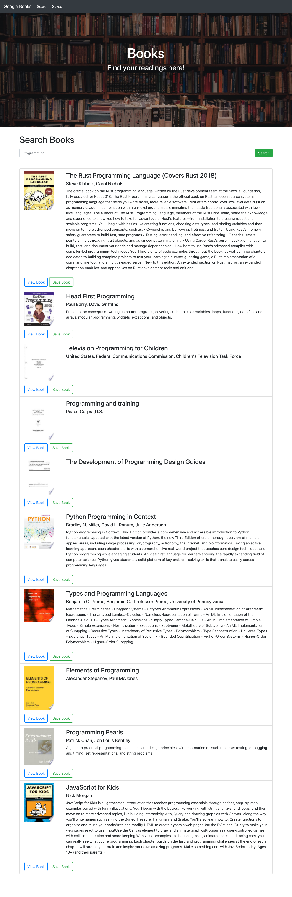
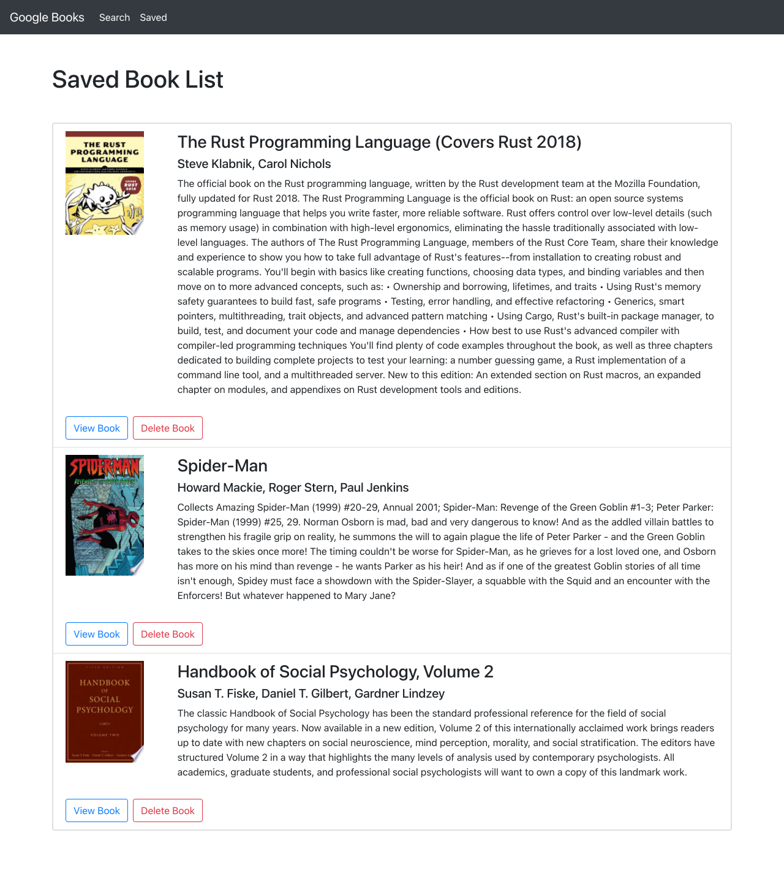

# Google-Books-Search

## Task

The purpose of this assignment is to create a google books search engine with books sources from googlebooks api so that the users can search and find the books they would like to read. The users also can save the books they found for reading later and delete the saved books they have read. This is a MERN application with React components for frontend desgin and to query and display the books base on users search, while Node, Express, and MongoDB are used for saving and deleting the books.

## Technologies Used

* React
* CSS
* Bootstrap
* JavaScript
* Node.js
* Express
* MongoDB

## Appearance and Functionality

Below is the page for searching books:

And the page for viewing saved books:

Here is the deployed link of the application: [Google Books Search](https://find-your-books.herokuapp.com/)

You can also explore this application through my [portfolio](https://yuwenyu.herokuapp.com/).

## URL Sources

Feel free to check the application repository: [https://github.com/ywen26/Google-Books-Search](https://github.com/ywen26/Google-Books-Search)

If you have any questions and ideas about this application, please contact me at: <yensonyu@gmail.com>

## Credits

Image sources: [https://www.pexels.com/](https://www.pexels.com/)

## License

MIT License

Copyright (c) [2021] [Ywuen Yu]

Permission is hereby granted, free of charge, to any person obtaining a copy of this software and associated documentation files (the "Software"), to deal in the Software without restriction, including without limitation the rights to use, copy, modify, merge, publish, distribute, sublicense, and/or sell copies of the Software, and to permit persons to whom the Software is furnished to do so, subject to the following conditions:

The above copyright notice and this permission notice shall be included in all copies or substantial portions of the Software.

THE SOFTWARE IS PROVIDED "AS IS", WITHOUT WARRANTY OF ANY KIND, EXPRESS OR IMPLIED, INCLUDING BUT NOT LIMITED TO THE WARRANTIES OF MERCHANTABILITY, FITNESS FOR A PARTICULAR PURPOSE AND NONINFRINGEMENT. IN NO EVENT SHALL THE AUTHORS OR COPYRIGHT HOLDERS BE LIABLE FOR ANY CLAIM, DAMAGES OR OTHER LIABILITY, WHETHER IN AN ACTION OF CONTRACT, TORT OR OTHERWISE, ARISING FROM, OUT OF OR IN CONNECTION WITH THE SOFTWARE OR THE USE OR OTHER DEALINGS IN THE SOFTWARE.
